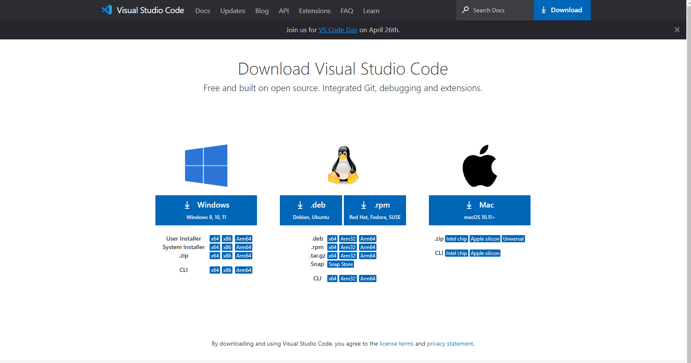
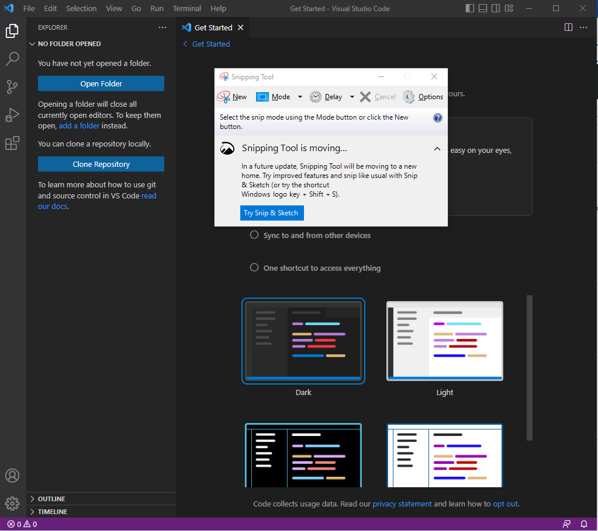
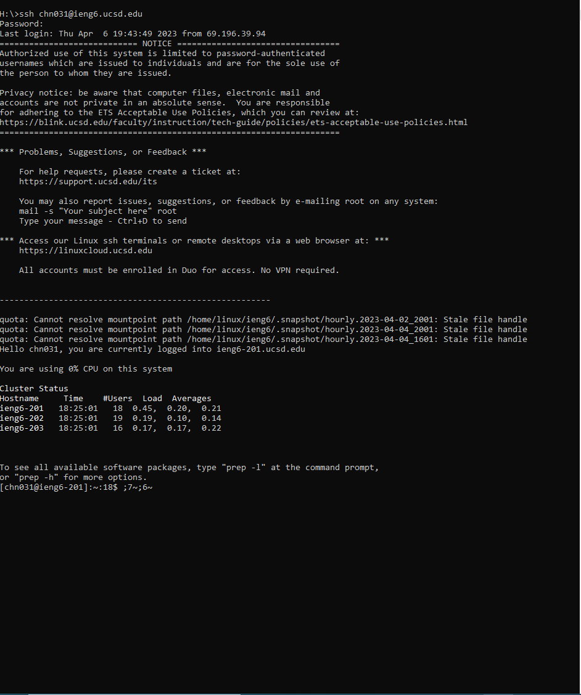
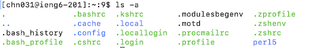

**Name:Chaklam Ng**
>
**Professor Joe**
>
**Course:CSE 15L**
>
**Date:01/13/2022**

___
# Installing VScode
>
This is telling you how to Installing VScode.
>
First step, go to Click the link of the bottom.
>
[VSCodeDownload](https://code.visualstudio.com/download)
>
You will see 3 option,Separately, they are Window,Mac,linux.Select one that your computer supports.

>
After installing the right version of visual studio code, we can click and launch the app. Then we will see the similar page as follow.

___
# Remotely Connecting
> 
In order to log in the course special account, we need to first look up our account from the ucsd lookup account page to find the `cs15lsp23xxx@ieng6.ucsd.edu` account.
However, I have tried to ssh my account with the command `ssh cs15lsp23ok@ieng6.ucsd.edu`. But what I have received from the console of the terminal is that the remote host closed error message. Hence I tried another way to ssh my regular ucsd ieng6 account.
```
ssh chn031@ieng6.ucsd.edu
```
Then I finally can log in to one of the ieng6 account. On the first time we logged into the account, it will ask us a question about whether **we are sure we want to continue connecting(yes/no/[fingerprint])** As I typed yes into the terminal and press enter, it guided me to the ieng6 account.The following is the screenshot of my logged in ieng6 account.
>

___
# Running some Command

```
ls -a
```
The command that I have tried in the ieng6 account is `ls -a` which is to list all the files within the account including any hidden files. However our group also tried some other commands. Such as,`ls`, `cd` and so on. For the command `cd`, the system will change directory to the specific directory that we specified in command line. For example, `cd ~` will return to the home directory and `cd ..` will return to the last directory.
In order to exit the ieng6 account, we can simply type `exit` and enter. Then it will log out the ieng6 account.
___
**Appreciate for reading my first lab report**
>
Sincerely,
>
Chaklam Ng
